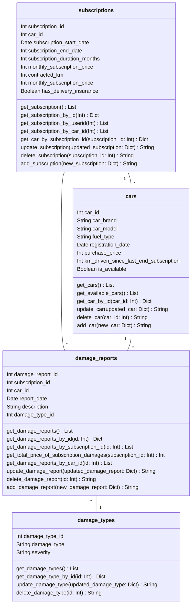
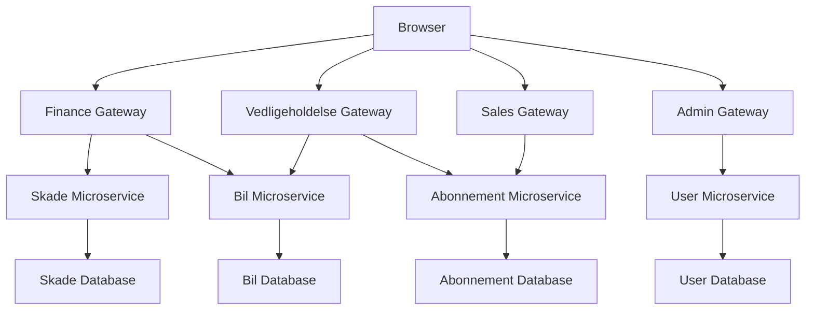

# Bilabonnement.dk

## Formål

## Opfyldelse af krav
I opgaven blev der stillet nogle krav som vi har løst gennem følgende gateways:

**Data registrering** : [sales-gateway](https://github.com/Bilabonnement-eksamensopgave-2024/sales-gateway)

**Skade og udbedring** : [maintenance-gateway](https://github.com/Bilabonnement-eksamensopgave-2024/maintenance-gateway)

**forretningsudviklere** : [finance-gateway](https://github.com/Bilabonnement-eksamensopgave-2024/finance-gateway)

## Domain-model

## Oversigt over Repositories

| Github repo | Azure deployed |
|------------|----------------|
| [user-microservice](https://github.com/Bilabonnement-eksamensopgave-2024/user-microservice) | [Azure](https://user-microservice-d6f9fsdkdzh7hndv.northeurope-01.azurewebsites.net/) |
| [abonnement-microservice](https://github.com/Bilabonnement-eksamensopgave-2024/abonnement-microservice) | [Azure](https://abonnement-microservice-dkeda4efcje4aega.northeurope-01.azurewebsites.net/) |
| [bil-microservice](https://github.com/Bilabonnement-eksamensopgave-2024/bil-microservice) | [Azure](https://car-microservice-ayhzdgdrfxgrdgby.northeurope-01.azurewebsites.net/) |
| [skade-microservice](https://github.com/Bilabonnement-eksamensopgave-2024/skade-microservice) | [Azure](https://skade-microservice-cufpgqgfcufqa8er.northeurope-01.azurewebsites.net/) |
| [admin-gateway](https://github.com/Bilabonnement-eksamensopgave-2024/admin-gateway) | [Azure-Health](https://admin-gateway-fqevcraygyfvafe2.northeurope-01.azurewebsites.net/health) |
| [finance-gateway](https://github.com/Bilabonnement-eksamensopgave-2024/finance-gateway) | [Azure](https://finance-gateway-b3grdpa6e6bterbg.northeurope-01.azurewebsites.net/) |
| [sales-gateway](https://github.com/Bilabonnement-eksamensopgave-2024/sales-gateway) | [Azure](https://sales-gateway-adcsa0dwahcxhkep.northeurope-01.azurewebsites.net/) |
| [maintenance-gateway](https://github.com/Bilabonnement-eksamensopgave-2024/maintenance-gateway) | [comming soon](TBA.com) |

---
## Arkitektur Diagram

Diagrammet viser, hvordan systemets mikroservice arkitektur er struktureret med de forskellige gateways og mikroservices, samt hvordan de relaterer til hinanden og databaserne.

## CI/CD pipeline

