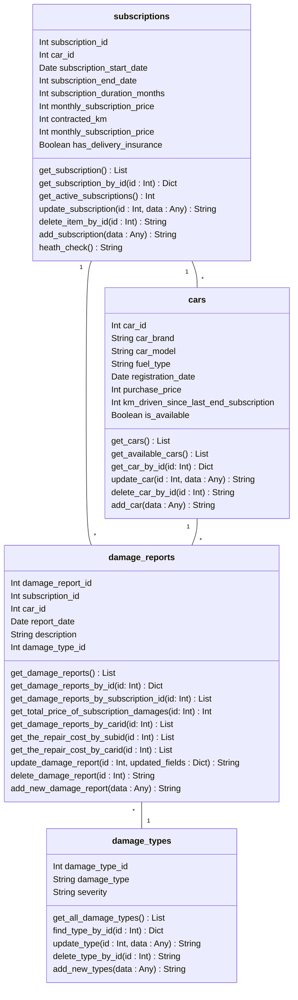
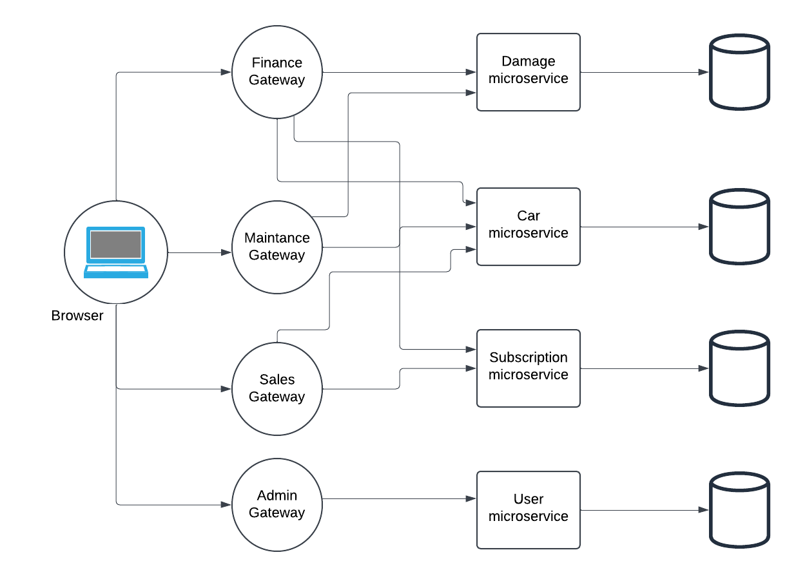
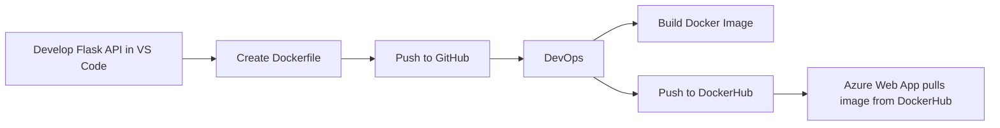

# Bilabonnement.dk


## Formål

Vi ønsker at udarbejde et minimal viable product som kan akkommodere den resterende rejse for bilen. Fra afhentningssted, til 
tilbagelevering og videre til skaderegistrering.

## Opfyldelse af krav
I opgaven blev der stillet nogle krav som vi har løst gennem følgende gateways:

**Data registrering** : [sales-gateway](https://github.com/Bilabonnement-eksamensopgave-2024/sales-gateway)

**Skade og udbedring** : [maintenance-gateway](https://github.com/Bilabonnement-eksamensopgave-2024/maintenance-gateway)

**forretningsudviklere** : [finance-gateway](https://github.com/Bilabonnement-eksamensopgave-2024/finance-gateway)

## User-guide for medarbejdere

Bekræft hos din arbejdsgiver at du er blevet oprettet i som medarbejder i systemet til den rigtige afdeleing.

1. ### Brug Postman eller lignende
   `method` POST
   
   `request` /din_afdelings_gateway_url/login
   
 ```json
{
    "email": "din_email@mail.com",
    "password": "paswoard123"
}
```
2. ### Du kan nu tilgå din afdelings endpoints
    

## Domain-model



## Oversigt over Repositories

| Github repo | Azure deployed |
|------------|----------------|
| [user-microservice](https://github.com/Bilabonnement-eksamensopgave-2024/user-microservice) | [Azure](https://user-microservice-d6f9fsdkdzh7hndv.northeurope-01.azurewebsites.net/) |
| [abonnement-microservice](https://github.com/Bilabonnement-eksamensopgave-2024/abonnement-microservice) | [Azure](https://abonnement-microservice-dkeda4efcje4aega.northeurope-01.azurewebsites.net/) |
| [bil-microservice](https://github.com/Bilabonnement-eksamensopgave-2024/bil-microservice) | [Azure](https://car-microservice-ayhzdgdrfxgrdgby.northeurope-01.azurewebsites.net/) |
| [skade-microservice](https://github.com/Bilabonnement-eksamensopgave-2024/skade-microservice) | [Azure](https://skade-microservice-cufpgqgfcufqa8er.northeurope-01.azurewebsites.net/) |
| [admin-gateway](https://github.com/Bilabonnement-eksamensopgave-2024/admin-gateway) | [Azure-Health](https://admin-gateway-fqevcraygyfvafe2.northeurope-01.azurewebsites.net/health) |
| [finance-gateway](https://github.com/Bilabonnement-eksamensopgave-2024/finance-gateway) | [Azure](https://finance-gateway-b3grdpa6e6bterbg.northeurope-01.azurewebsites.net/) |
| [sales-gateway](https://github.com/Bilabonnement-eksamensopgave-2024/sales-gateway) | [Azure](https://sales-gateway-adcsa0dwahcxhkep.northeurope-01.azurewebsites.net/) |
| [maintenance-gateway](https://github.com/Bilabonnement-eksamensopgave-2024/maintenance-gateway) | [comming soon](TBA.com) |

### Roller

Da vi arbejder med JWT authentication har vi valgt at en user skal have en rolle før de kan tilgå en gateway. De roller og deres gateways er således:

| Gateway | Role Required |
|------------|----------------|
| admin-gateway | `admin` |
| finance-gateway | `finance` |
| sales-gateway | `sales` |
| maintenance-gateway | `maintenance` |

---
## Arkitektur Diagram



Diagrammet viser, hvordan systemets mikroservice arkitektur er struktureret med de forskellige gateways og mikroservices, samt hvordan de relaterer til hinanden og databaserne.

## CI/CD pipeline



Diagrammet viser en CI/CD-pipeline til deployment af en Flask API-applikation. Her er en kort forklaring:

1. **Udvikling**  
   Flask API udvikles i Visual Studio Code (eller et andet IDE).

2. **Dockerfile oprettes**  
   En Dockerfile skrives for at containerisere applikationen.

3. **Push til GitHub**  
   Koden pushes til et GitHub-repository for versionskontrol og samarbejde.

4. **DevOps-processen**  
   - **Build Docker Image**: En Docker-container bygges automatisk ud fra koden og Dockerfilen.
   - **Push to DockerHub**: Docker-image pushes til DockerHub, som fungerer som en container registry.

5. **Deployment**  
   Azure Web App trækker Docker-imaget fra DockerHub og deployer applikationen, så den er tilgængelig for brugere.

Denne pipeline automatiserer processen fra udvikling til deployment, hvilket gør det nemt og hurtigt at rulle opdateringer ud.

